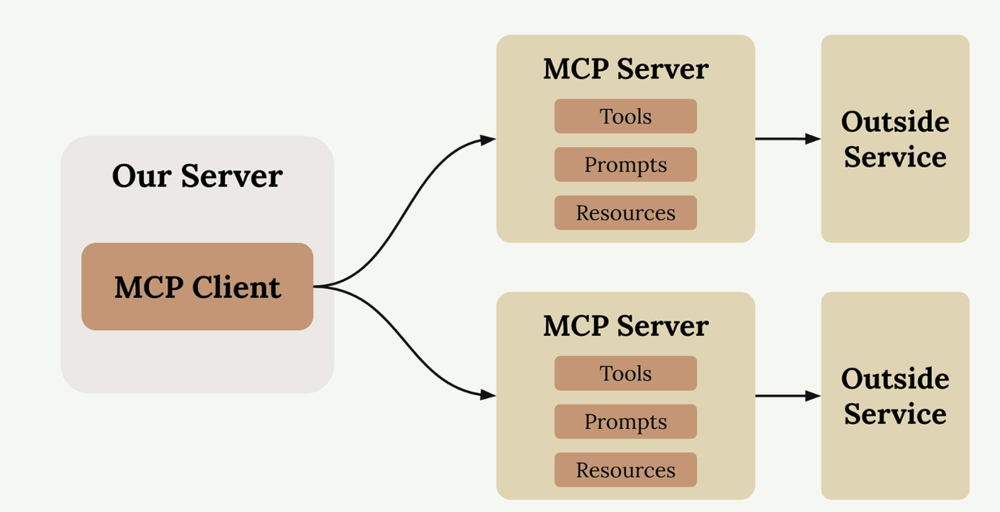
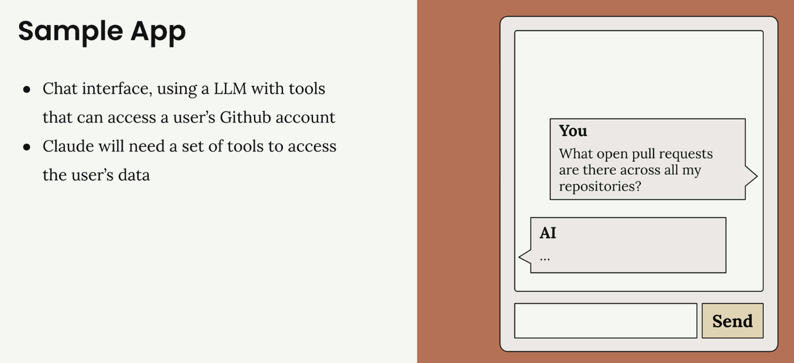
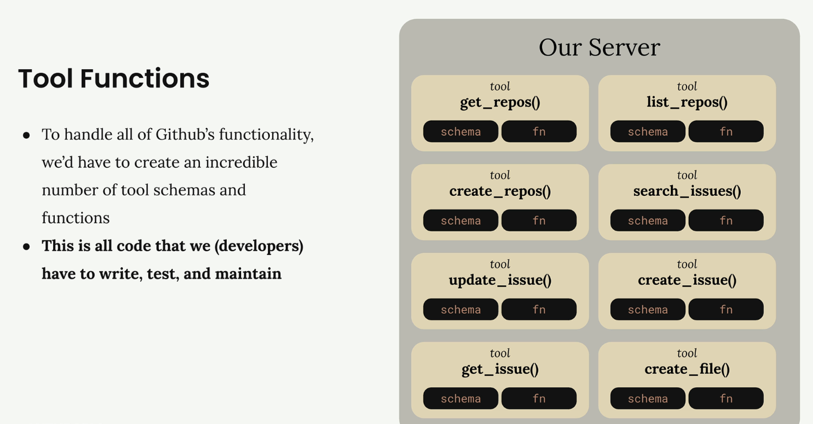
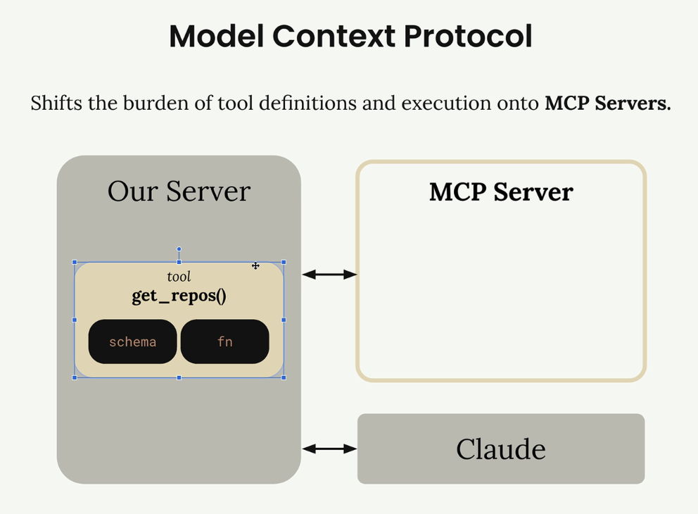
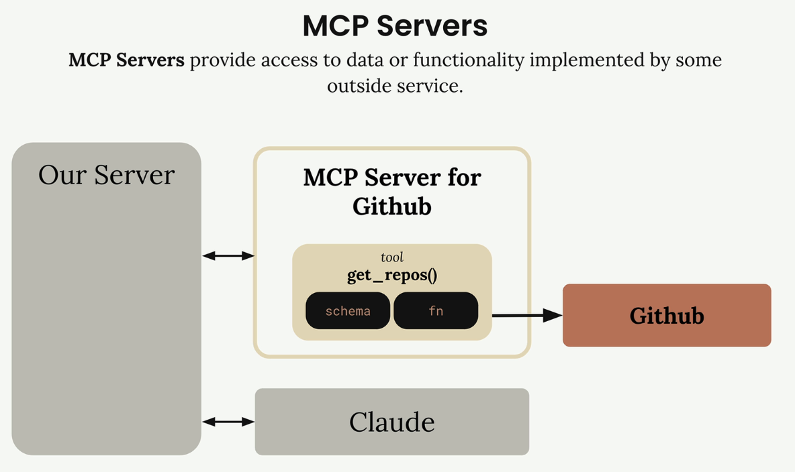

# 🚀 Introducción a MCP

> **Model Context Protocol (MCP)** es una capa de comunicación que proporciona a Claude contexto y herramientas sin requerir que escribas una gran cantidad de código de integración tedioso. Piénsalo como una forma de transferir la carga de definiciones y ejecución de herramientas desde tu servidor a **MCP servers** especializados.

Cuando te encuentres por primera vez con **MCP**, verás diagramas que muestran la arquitectura básica: un **MCP Client** (tu servidor) conectándose a **MCP Servers** que contienen tools, prompts y resources. Cada **MCP Server** actúa como una interfaz a algún servicio externo.

---

## 🔧 El Problema que Resuelve MCP

Imaginemos que estás construyendo una interfaz de chat donde los usuarios pueden preguntarle a Claude sobre sus datos de GitHub. Un usuario podría preguntar:

> *"¿Qué pull requests abiertos hay en todos mis repositorios?"*

Para manejar esto, Claude necesita **tools** para acceder a la API de GitHub.

GitHub tiene una funcionalidad masiva:
- 📂 **Repositories**
- 🔄 **Pull requests**
- 🐛 **Issues**
- 📋 **Projects**
- Y mucho más...

Sin **MCP**, necesitarías crear una cantidad increíble de **tool schemas** y funciones para manejar todas las características de GitHub.

Esto significa escribir, probar y mantener todo ese código de integración tú mismo. Es mucho esfuerzo y una carga de mantenimiento continua.

---

## ⚙️ Cómo Funciona MCP

**MCP** transfiere esta carga moviendo las definiciones y ejecución de **tools** desde tu servidor a **MCP servers** dedicados. En lugar de que tú escribas todas esas herramientas de GitHub, un **MCP Server** para GitHub lo maneja.

El **MCP Server** envuelve toneladas de funcionalidad alrededor de GitHub y la expone como un conjunto estandarizado de **tools**. Tu aplicación se conecta a este **MCP server** en lugar de implementar todo desde cero.

---

## 🏗️ MCP Servers Explicados

Los **MCP Servers** proporcionan acceso a datos o funcionalidad implementada por servicios externos. Actúan como interfaces especializadas que exponen **tools**, **prompts** y **resources** de manera estandarizada.

En nuestro ejemplo de GitHub, el **MCP Server** para GitHub contiene herramientas como `get_repos()` y se conecta directamente a la API de GitHub. Tu servidor se comunica con el **MCP server**, que maneja todos los detalles de implementación específicos de GitHub.

### 🔑 Características Clave:

- ✅ **Abstracción simplificada**: No necesitas conocer los detalles internos de cada API
- ✅ **Estandarización**: Todos los **MCP Servers** siguen el mismo protocolo
- ✅ **Mantenimiento reducido**: Los **tools** y su lógica están centralizados
- ✅ **Escalabilidad**: Fácil agregar nuevos servicios a través de nuevos **MCP Servers**