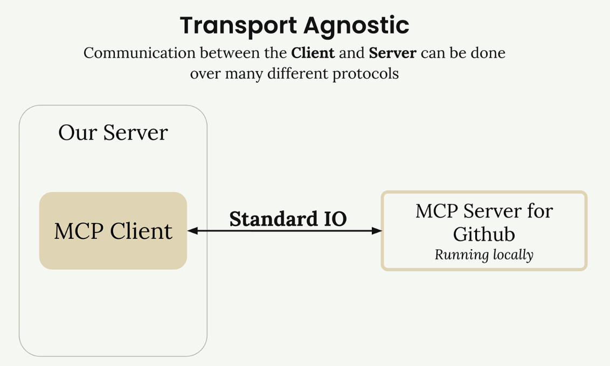
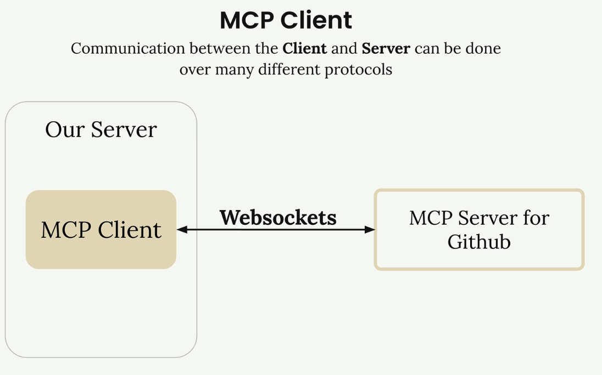
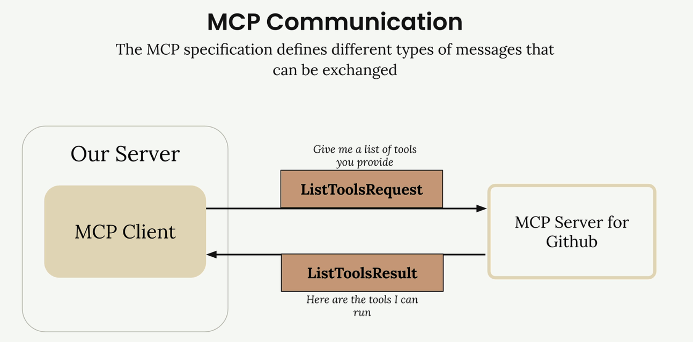
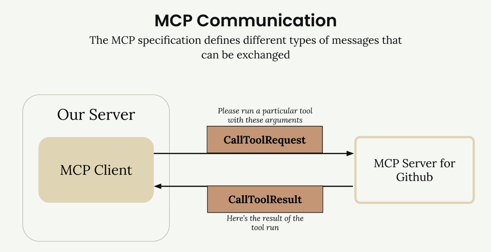
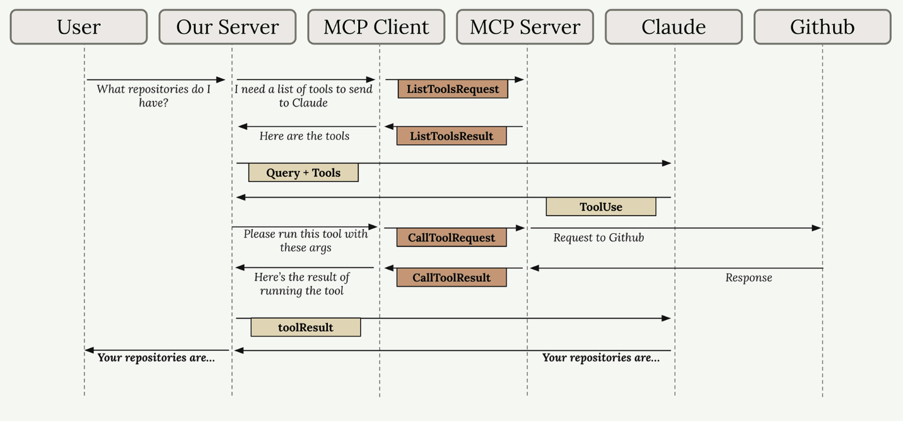

# 🔗 MCP Clients

> El **MCP client** sirve como el puente de comunicación entre tu servidor y los **MCP servers**. Es tu punto de acceso a todas las **tools** que un **MCP server** proporciona, manejando el intercambio de mensajes y los detalles del protocolo para que tu aplicación no tenga que hacerlo.

## 🌐 Comunicación Transport-Agnostic

Una de las fortalezas clave de **MCP** es ser **transport agnostic** - una forma elegante de decir que el **client** y **server** pueden comunicarse a través de diferentes protocolos dependiendo de tu configuración.

La configuración más común ejecuta tanto el **MCP client** como el **server** en la misma máquina, comunicándose a través de **standard input/output**. Pero también puedes conectarlos a través de:

- 🌐 **HTTP**
- 🔄 **WebSockets**
- 🔌 Varios otros protocolos de red

## 📨 Tipos de Mensajes MCP

Una vez conectados, el **client** y **server** intercambian tipos de mensajes específicos definidos en la especificación de **MCP**. Los principales con los que trabajarás son:

### `ListToolsRequest` / `ListToolsResult`
El **client** le pregunta al **server** "¿qué **tools** proporcionas?" y recibe una lista de **tools** disponibles.

### `CallToolRequest` / `CallToolResult`
El **client** le pide al **server** que ejecute una **tool** específica con argumentos dados, luego recibe los resultados.

---

## 🔄 Cómo Funciona Todo Junto

Aquí tienes un ejemplo completo mostrando cómo una consulta del usuario fluye a través de todo el sistema - desde tu servidor, a través del **MCP client**, a servicios externos como GitHub, y de vuelta a Claude.

Imaginemos que un usuario pregunta: *"¿Qué repositorios tengo?"* Aquí está el flujo paso a paso:

### 📋 Flujo Completo del Sistema

1. **🔍 User Query**: El usuario envía su pregunta a tu servidor
2. **🛠️ Tool Discovery**: Tu servidor necesita saber qué **tools** están disponibles para enviar a Claude
3. **📋 List Tools Exchange**: Tu servidor le pide al **MCP client** las **tools** disponibles
4. **🔗 MCP Communication**: El **MCP client** envía un `ListToolsRequest` al **MCP server** y recibe un `ListToolsResult`
5. **🤖 Claude Request**: Tu servidor envía la consulta del usuario más las **tools** disponibles a Claude
6. **🎯 Tool Use Decision**: Claude decide que necesita llamar una **tool** para responder la pregunta
7. **⚡ Tool Execution Request**: Tu servidor le pide al **MCP client** que ejecute la **tool** que Claude especificó
8. **🌐 External API Call**: El **MCP client** envía un `CallToolRequest` al **MCP server**, que hace la llamada real a la API de GitHub
9. **📤 Results Flow Back**: GitHub responde con datos de repositorios, que fluyen de vuelta a través del **MCP server** como un `CallToolResult`
10. **🔄 Tool Result to Claude**: Tu servidor envía los resultados de la **tool** de vuelta a Claude
11. **💡 Final Response**: Claude formula una respuesta final usando los datos del repositorio
12. **👤 User Gets Answer**: Tu servidor entrega la respuesta de Claude de vuelta al usuario

## 🎯 Puntos Clave

Sí, este flujo involucra muchos pasos, pero cada componente tiene una responsabilidad clara. El **MCP client** abstrae la complejidad de la comunicación del servidor, permitiéndote enfocarte en la lógica de tu aplicación mientras sigues teniendo acceso a **tools** externas poderosas y fuentes de datos.

### 🔑 Beneficios de esta Arquitectura:

- ✅ **Separación de responsabilidades**: Cada componente tiene un rol específico
- ✅ **Abstracción de complejidad**: El **MCP client** maneja los detalles de comunicación
- ✅ **Flexibilidad**: Puedes cambiar **MCP servers** sin modificar tu aplicación
- ✅ **Escalabilidad**: Fácil agregar nuevos servicios y **tools**

> **💡 Importante**: Entender este flujo es crucial porque verás todas estas piezas cuando construyas tus propios **MCP clients** y **servers** en las próximas secciones.