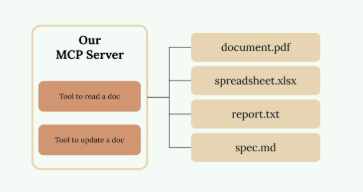

# Construyendo Servidores MCP con Python SDK

Construir un servidor MCP se vuelve mucho más simple cuando usas el Python SDK oficial. En lugar de escribir esquemas JSON complejos manualmente, puedes definir herramientas con decoradores y dejar que el SDK maneje el trabajo pesado.



## Descripción General

En este ejemplo, estamos creando un servidor de gestión de documentos con dos herramientas principales:
- **Document Reader**: Leer contenido de documentos por ID
- **Document Editor**: Actualizar documentos con operaciones de buscar y reemplazar

Todos los documentos existen en memoria como un diccionario simple donde las claves son IDs de documentos y los valores son el contenido.

## Configurando el Servidor MCP

El Python MCP SDK hace que la creación de servidores sea directa. Puedes inicializar un servidor con solo una línea:

```python
from mcp.server.fastmcp import FastMCP

mcp = FastMCP("DocumentMCP", log_level="ERROR")
```

Tus documentos pueden almacenarse en una estructura de diccionario simple:

```python
docs = {
    "deposition.md": "This deposition covers the testimony of Angela Smith, P.E.",
    "report.pdf": "The report details the state of a 20m condenser tower.",
    "financials.docx": "These financials outline the project's budget and expenditures",
    "outlook.pdf": "This document presents the projected future performance of the system",
    "plan.md": "The plan outlines the steps for the project's implementation.",
    "spec.txt": "These specifications define the technical requirements for the equipment"
}
```

## Definición de Herramientas con Decoradores

El SDK usa decoradores para definir herramientas. En lugar de escribir esquemas JSON manualmente, puedes usar type hints de Python y descripciones de campos. El SDK genera automáticamente el esquema apropiado que Claude puede entender.

### Creando una Herramienta de Lectura de Documentos

La primera herramienta lee el contenido de documentos por ID. Aquí está la implementación completa:

```python
@mcp.tool(
    name="read_doc_contents",
    description="Read the contents of a document and return it as a string."
)
def read_document(
    doc_id: str = Field(description="Id of the document to read")
):
    if doc_id not in docs:
        raise ValueError(f"Doc with id {doc_id} not found")
    
    return docs[doc_id]
```

El decorador especifica el nombre de la herramienta y la descripción, mientras que los parámetros de la función definen los argumentos requeridos. La clase `Field` de Pydantic proporciona descripciones de argumentos que ayudan a Claude a entender qué espera cada parámetro.

### Construyendo una Herramienta de Edición de Documentos

La segunda herramienta realiza operaciones simples de buscar y reemplazar en documentos:

```python
@mcp.tool(
    name="edit_document",
    description="Edit a document by replacing a string in the documents content with a new string."
)
def edit_document(
    doc_id: str = Field(description="Id of the document that will be edited"),
    old_str: str = Field(description="The text to replace. Must match exactly, including whitespace."),
    new_str: str = Field(description="The new text to insert in place of the old text.")
):
    if doc_id not in docs:
        raise ValueError(f"Doc with id {doc_id} not found")
    
    docs[doc_id] = docs[doc_id].replace(old_str, new_str)
```

Esta herramienta toma tres parámetros:
- **doc_id**: El ID del documento a editar
- **old_str**: El texto a buscar y reemplazar
- **new_str**: El texto de reemplazo

La implementación incluye manejo de errores para documentos faltantes y realiza un reemplazo de cadenas directo.

## Beneficios Clave del Enfoque SDK

✅ **No se requiere escritura manual de esquemas JSON**  
✅ **Los type hints proporcionan validación automática**  
✅ **Las descripciones claras de parámetros ayudan a Claude a entender el uso de herramientas**  
✅ **El manejo de errores se integra naturalmente con las excepciones de Python**  
✅ **El registro de herramientas ocurre automáticamente a través de decoradores**

---

El Python MCP SDK transforma la creación de herramientas de un ejercicio complejo de escritura de esquemas en definiciones simples de funciones Python. Este enfoque hace que sea mucho más fácil construir y mantener servidores MCP mientras asegura que Claude reciba especificaciones de herramientas correctamente formateadas.