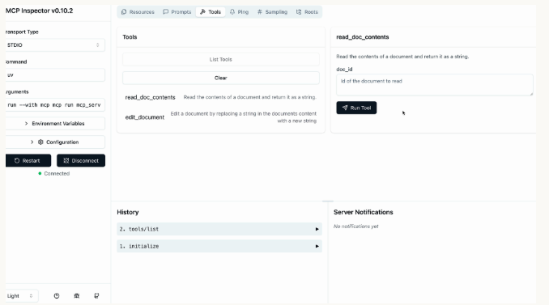

# Inspector de Servidores MCP

Cuando construyes servidores MCP, necesitas una forma de probar tu funcionalidad sin conectarte a una aplicación completa. El Python MCP SDK incluye un inspector basado en navegador integrado que te permite depurar y probar tu servidor en tiempo real.

## Iniciando el Inspector

Primero, asegúrate de que tu entorno Python esté activado (revisa el README de tu proyecto para el comando exacto). Luego ejecuta el inspector con:

```bash
mcp dev mcp_server.py
```

Esto inicia un servidor de desarrollo y te da una URL local, típicamente algo como `http://127.0.0.1:6274`. Abre esta URL en tu navegador para acceder al MCP Inspector.

## Usando la Interfaz del Inspector

La interfaz del inspector está siendo desarrollada activamente, por lo que puede verse diferente cuando la uses. Sin embargo, la funcionalidad principal permanece consistente. Busca estos elementos clave:

- Un botón **Connect** para iniciar tu servidor MCP
- Pestañas de navegación para **Resources**, **Tools**, **Prompts** y otras características
- Una lista de herramientas y panel de pruebas

Haz clic en el botón **Connect** primero para inicializar tu servidor. Verás que el estado de conexión cambie de "Disconnected" a "Connected".

## Probando tus Herramientas

Navega a la sección **Tools** y haz clic en "List Tools" para ver todas las herramientas disponibles de tu servidor. Cuando selecciones una herramienta, el panel derecho muestra sus detalles y campos de entrada.



Por ejemplo, para probar una herramienta de lectura de documentos:

1. Selecciona la herramienta `read_doc_contents`
2. Ingresa un ID de documento (como "deposition.md")
3. Haz clic en "Run Tool"
4. Revisa los resultados para verificar el éxito y la salida esperada

El inspector muestra tanto el estado de éxito como los datos devueltos realmente, haciendo fácil verificar que tu herramienta funciona correctamente.

## Probando Interacciones entre Herramientas

Puedes probar múltiples herramientas en secuencia para verificar flujos de trabajo complejos. Por ejemplo, después de usar una herramienta de edición para modificar un documento, inmediatamente prueba la herramienta de lectura para confirmar que los cambios se aplicaron correctamente.

El inspector mantiene el estado de tu servidor entre llamadas de herramientas, por lo que las ediciones persisten y puedes verificar la funcionalidad completa de tu servidor MCP.

## Flujo de Trabajo de Desarrollo

El MCP Inspector se convierte en una parte esencial de tu proceso de desarrollo. En lugar de escribir scripts de prueba separados o conectarte a aplicaciones completas, puedes:

✅ **Iterar rápidamente en implementaciones de herramientas**  
✅ **Probar casos extremos y condiciones de error**  
✅ **Verificar interacciones de herramientas y gestión de estado**  
✅ **Depurar problemas en tiempo real**

Este ciclo de retroalimentación inmediata hace que el desarrollo de servidores MCP sea mucho más eficiente y ayuda a detectar problemas temprano en el proceso de desarrollo.