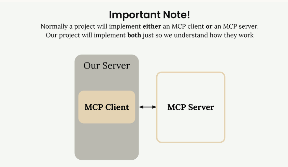
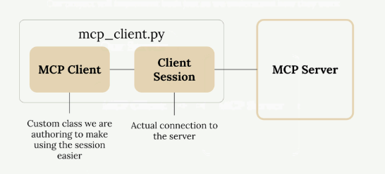
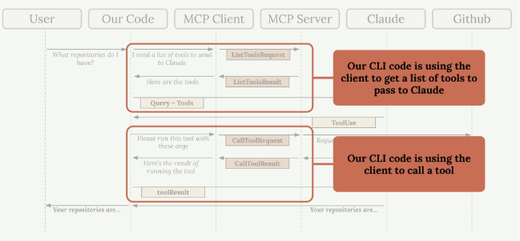

# Implementando el Cliente MCP

Ahora que tenemos nuestro servidor MCP funcionando, es momento de construir el lado del cliente. El cliente es lo que permite que nuestro código de aplicación se comunique con el servidor MCP y acceda a su funcionalidad.

## Entendiendo la Arquitectura del Cliente

En la mayoría de proyectos del mundo real, implementarás un cliente MCP o un servidor MCP - no ambos. Estamos construyendo ambos en este proyecto solo para que puedas ver cómo trabajan juntos.



El cliente MCP consiste en dos componentes principales:

- **MCP Client**: Una clase personalizada que creamos para hacer más fácil el uso de la sesión
- **Client Session**: La conexión real al servidor (parte del Python MCP SDK)



La sesión del cliente requiere gestión cuidadosa de recursos - necesitamos limpiar apropiadamente las conexiones cuando terminemos. Por eso la envolvemos en nuestra propia clase que maneja toda la limpieza automáticamente.

## Cómo el Cliente se Integra en Nuestra Aplicación

¿Recuerdas nuestro diagrama de flujo de aplicación? El cliente es lo que permite que nuestro código interactúe con el servidor MCP en dos puntos clave:



Nuestro código CLI usa el cliente para:

- Obtener una lista de herramientas disponibles para enviar a Claude
- Ejecutar herramientas cuando Claude las solicita

## Implementando Funciones Principales del Cliente

Necesitamos implementar dos funciones esenciales: `list_tools()` y `call_tool()`.

### Función List Tools

Esta función obtiene todas las herramientas disponibles del servidor MCP:

```python
async def list_tools(self) -> list[types.Tool]:
    result = await self.session().list_tools()
    return result.tools
```

Es directa - accedemos a nuestra sesión (la conexión al servidor), llamamos al método `list_tools()` integrado, y devolvemos las herramientas del resultado.

### Función Call Tool

Esta función ejecuta una herramienta específica en el servidor:

```python
async def call_tool(
    self, tool_name: str, tool_input: dict
) -> types.CallToolResult | None:
    return await self.session().call_tool(tool_name, tool_input)
```

Pasamos el nombre de la herramienta y los parámetros de entrada (proporcionados por Claude) al servidor y devolvemos el resultado.

## Probando el Cliente

El archivo del cliente incluye un arnés de prueba simple en la parte inferior. Puedes ejecutarlo directamente para verificar que todo funciona:

```bash
uv run mcp_client.py
```

Esto se conectará a tu servidor MCP e imprimirá las herramientas disponibles. Deberías ver salida mostrando las definiciones de tus herramientas, incluyendo descripciones y esquemas de entrada.

## Poniéndolo Todo Junto

Una vez que las funciones del cliente están implementadas, puedes probar el flujo completo ejecutando tu aplicación principal:

```bash
uv run main.py
```

Intenta preguntar: "What is the contents of the report.pdf document?"

Aquí está lo que sucede detrás de escenas:

1. Tu aplicación usa el cliente para obtener herramientas disponibles
2. Estas herramientas se envían a Claude junto con tu pregunta
3. Claude decide usar la herramienta `read_doc_contents`
4. Tu aplicación usa el cliente para ejecutar esa herramienta
5. El resultado se devuelve a Claude, quien luego responde a ti

El cliente actúa como el puente entre la lógica de tu aplicación y la funcionalidad del servidor MCP, haciendo fácil integrar herramientas poderosas en tus flujos de trabajo de IA.