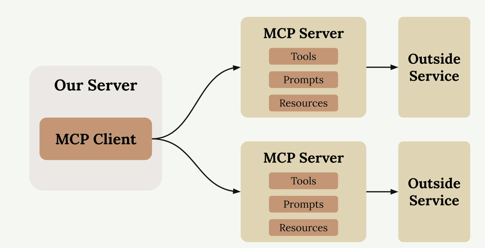

# 🤖 Curso MCP con Anthropic

> **Model Context Protocol (MCP)** - Aprende a integrar Claude con herramientas externas de manera eficiente



## 📋 Descripción del Curso

Este curso te enseñará cómo utilizar el **Model Context Protocol (MCP)** para crear integraciones poderosas entre Claude y servicios externos. Aprenderás desde los conceptos básicos hasta implementaciones avanzadas.

## 🎯 Objetivos de Aprendizaje

Al finalizar este curso serás capaz de:

- ✅ Entender qué es **MCP** y cómo funciona
- ✅ Configurar **MCP Clients** y **MCP Servers**
- ✅ Crear **tools** personalizados para Claude
- ✅ Integrar servicios como GitHub, bases de datos y APIs
- ✅ Implementar **prompts** y **resources** dinámicos
- ✅ Manejar autenticación y seguridad en **MCP**

## 📚 Contenido del Curso

### Módulo 1: Fundamentos
- [🚀 Introducción a MCP](01-introducing-MCP.md)
- ⚙️ Arquitectura y componentes
- 🔧 Instalación y configuración

### Módulo 2: Desarrollo Básico
- 🛠️ Creando tu primer **MCP Server**
- 📝 Definiendo **tools** básicos
- 🔗 Conectando con Claude

### Módulo 3: Integraciones Avanzadas
- 🐙 Integración con GitHub
- 🗄️ Conectando bases de datos
- 🌐 APIs RESTful y GraphQL

### Módulo 4: Mejores Prácticas
- 🔒 Seguridad y autenticación
- 📊 Monitoreo y debugging
- 🚀 Despliegue en producción

## 🛠️ Requisitos Previos

- **Python 3.8+** o **Node.js 16+**
- Conocimientos básicos de APIs REST
- Cuenta de Anthropic (Claude)
- Git instalado

## 🚀 Inicio Rápido

1. **Clona el repositorio:**
   ```bash
   git clone https://github.com/isbais/mcp-anthropic-curso.git
   cd mcp-anthropic-curso
   ```

2. **Instala dependencias:**
   ```bash
   # Para Python
   pip install -r requirements.txt
   
   # Para Node.js
   npm install
   ```

3. **Comienza con el primer módulo:**
   - Lee [Introducción a MCP](01-introducing-MCP.md)
   - Sigue los ejemplos prácticos

## 📁 Estructura del Repositorio

```
mcp-anthropic-curso/
├── README.md                 # Este archivo
├── 01-introducing-MCP.md     # Introducción al curso
├── images/                   # Recursos visuales
│   ├── mcp-general.png
│   ├── mcp-example.png
│   └── ...
├── ejemplos/                 # Código de ejemplo
│   ├── basico/
│   ├── github-integration/
│   └── database-connector/
├── ejercicios/               # Ejercicios prácticos
└── recursos/                 # Material adicional
```

## 🤝 Contribuir

¡Las contribuciones son bienvenidas! Si encuentras errores o quieres mejorar el contenido:

1. Fork el repositorio
2. Crea una rama para tu feature (`git checkout -b feature/mejora`)
3. Commit tus cambios (`git commit -am 'Agrega nueva funcionalidad'`)
4. Push a la rama (`git push origin feature/mejora`)
5. Crea un Pull Request

## 📞 Soporte

- **Issues**: [GitHub Issues](https://github.com/isbais/mcp-anthropic-curso/issues)
- **Discusiones**: [GitHub Discussions](https://github.com/isbais/mcp-anthropic-curso/discussions)
- **Email**: [tu-email@ejemplo.com]

## 📄 Licencia

Este proyecto está bajo la Licencia MIT. Ver el archivo [LICENSE](LICENSE) para más detalles.

## 🙏 Agradecimientos

- **Anthropic** por desarrollar MCP y Claude
- La comunidad de desarrolladores de IA
- Todos los contribuidores del curso

---

⭐ **¡Si este curso te resulta útil, no olvides darle una estrella al repositorio!**
